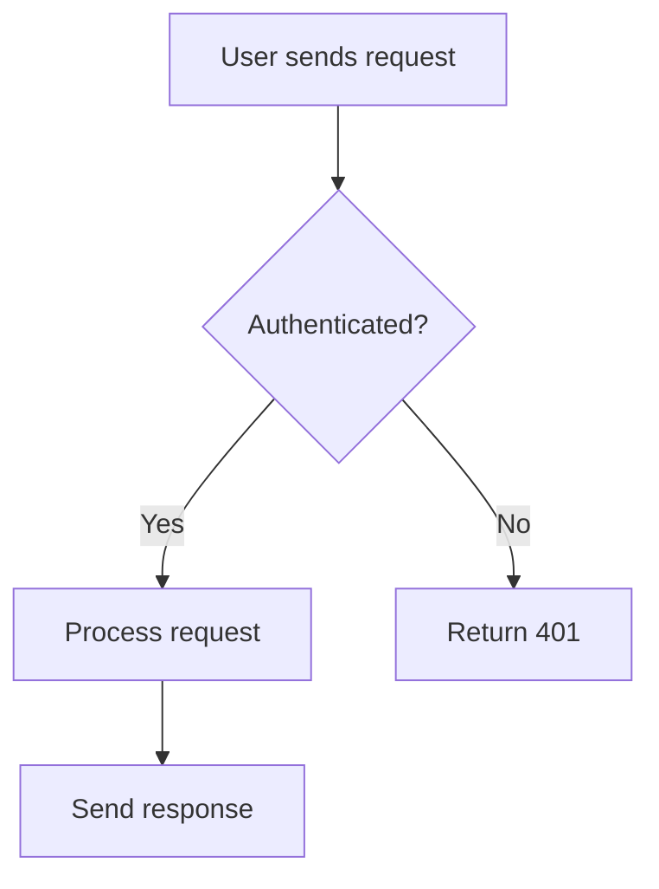
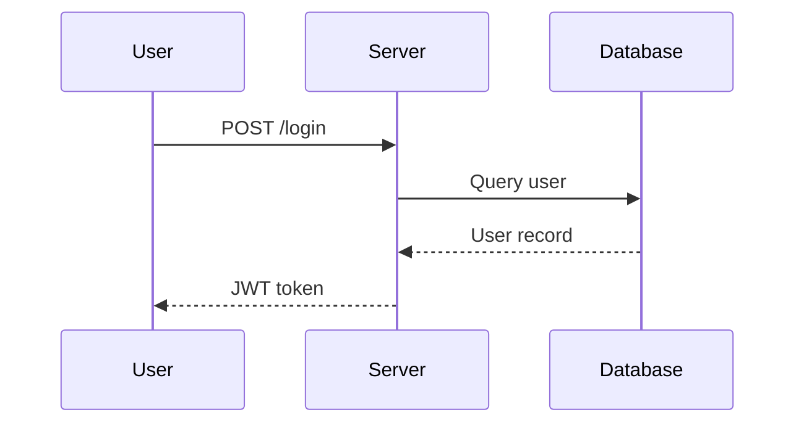
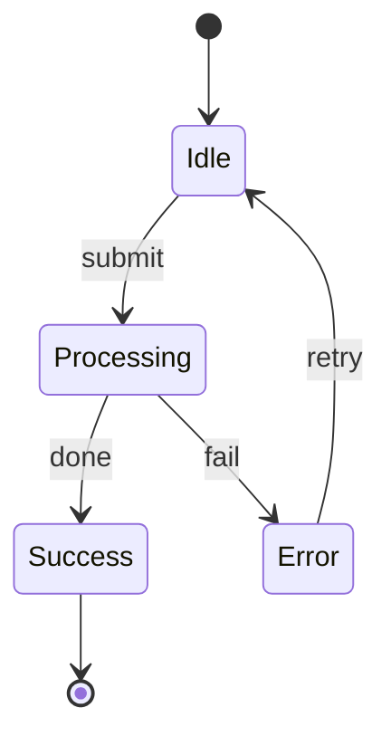

# Explain — Visual Step-by-Step Explanations

Generate a rich, visual Markdown explanation and save it to a tmp file so the user
can open it in a previewer that renders Mermaid diagrams.

## Workflow

1. **Understand the question** — Figure out exactly what the user wants explained.
   If ambiguous, ask one clarifying question before proceeding.

2. **Research if needed** — Read relevant source files, docs, or code to ensure
   accuracy. Never guess when you can look.

3. **Write the explanation** — Create a Markdown file with the structure below.

4. **Save and report** — Write the file to `$TMPDIR/explain-<slug>.md` (where
   `<slug>` is a short kebab-case summary of the topic). Tell the user the path
   so they can open it.

## Writing Guidelines

The goal is to make complex things feel approachable. Write as if you're explaining
to a curious colleague — not dumbing things down, but making sure every step is
clear before moving to the next.

- **Use Mermaid diagrams liberally.** Every explanation should include at least 2-3
  diagrams. Pick the right diagram type for the content:
  - `flowchart TD/LR` — for processes, decision trees, control flow
  - `sequenceDiagram` — for interactions between components/services/people
  - `classDiagram` — for data structures, class hierarchies
  - `stateDiagram-v2` — for state machines, lifecycle
  - `erDiagram` — for data models, relationships
  - `gantt` — for timelines, phases
  - `graph` — for dependency graphs, architecture overviews
  - `pie` — for proportions, breakdowns
  - `mindmap` — for concept maps, topic overviews

- **Alternate between text and visuals.** Don't dump all diagrams at the end.
  Weave them into the narrative — explain a concept in words, then immediately
  reinforce it with a diagram.

- **Use numbered steps.** Break the explanation into clear stages. Each step should
  have a heading, a short prose explanation, and (where helpful) a diagram.

- **Use concrete examples.** Abstract explanations are hard to follow. Ground each
  concept in a specific, relatable example.

- **Use callouts for important points.** Use blockquotes (`>`) to highlight key
  takeaways, common mistakes, or "aha" moments.

- **Keep individual sections short.** If a section is getting long, split it.
  Readers should feel like they're making progress.

## Output Template

````markdown
# <Topic Title>

<One-paragraph overview of what this explanation covers and why it matters.>

```mermaid
<overview diagram — a high-level map of the topic>
```

---

## Step 1: <First Concept>

<Prose explanation>

```mermaid
<supporting diagram>
```

> **Key takeaway:** <one-sentence summary of this step>

---

## Step 2: <Next Concept>

...continue the pattern...

---

## Summary

<Brief recap tying everything together.>

```mermaid
<final diagram — a complete picture showing how all the pieces connect>
```
````

## Example: Mermaid Diagram Styles

Here are examples of well-formatted Mermaid blocks to reference:

**Flowchart:**
````markdown

````

**Sequence Diagram:**
````markdown

````

**State Diagram:**
````markdown

````

## Important Notes

- The output file MUST be saved to a tmp directory (`$TMPDIR`), not the project.
- Use `open <filepath>` to suggest the user open it, but do NOT run `open` yourself.
- File name format: `explain-<topic-slug>.md` (e.g., `explain-git-rebase.md`)
- Write in the same language the user used to ask the question.
